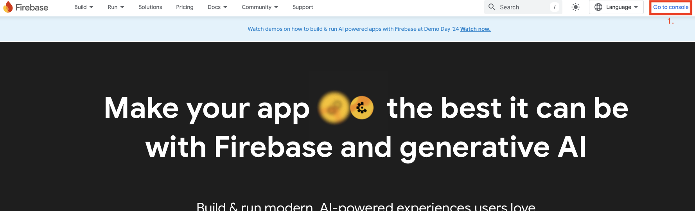
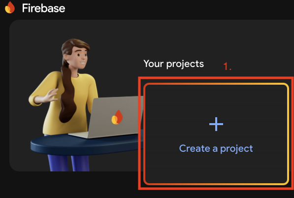
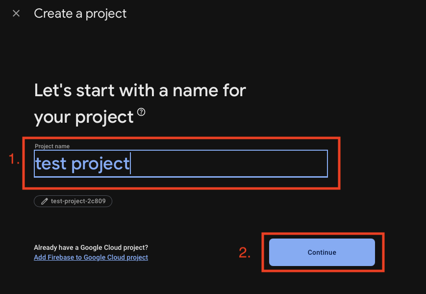
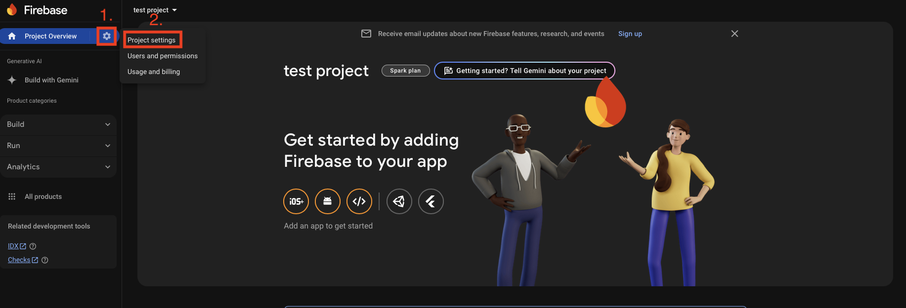
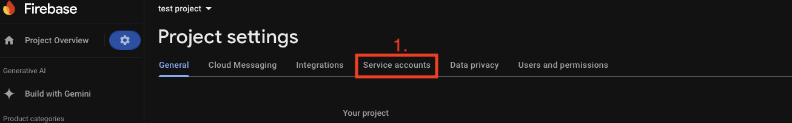
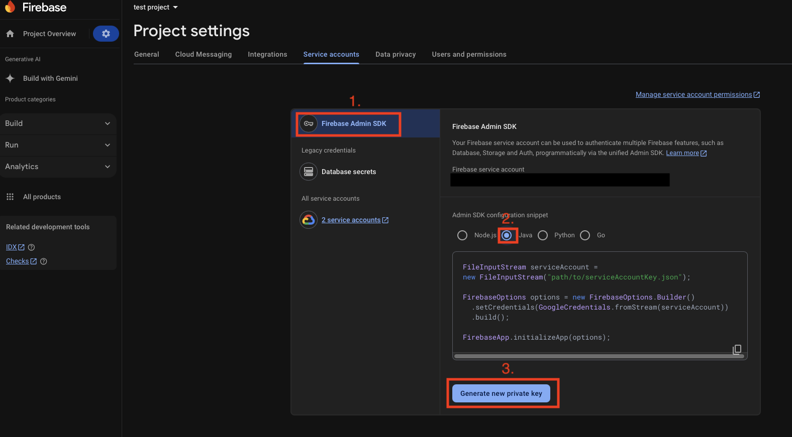

# Configure and run
## Local build
Prerequisites:
```bash
sudo apt install curl libyaml-cpp-dev libjsoncpp-dev libcurl4-openssl-dev -y
```
Build:
```bash
mkdir -p ~/wisevision_notification_manager_ws/src && cd ~/wisevision_notification_manager_ws/src
git clone git@github.com:wise-vision/wisevision_notification_manager.git
cd wisevision_notification_manager
vcs import --recursive < wisevision_notification_manager.repos
```


## Local run
Prequistances:

### Push notifications:

***Firebase*** is a platform developed by Google that provides tools and services to support the development of mobile and web applications. In this application, Firebase is used to send push notifications, enabling real-time communication with users by delivering important updates, events, or messages directly to their mobile devices.

In `wisevision_notification_manager_ws` copy `deviceTokens_example.json` from `wisevision_notification_manager` into `deviceTokens.json`
```bash
cd ~/wisevision_notification_manager_ws
cp src/wisevision_notification_manager/deviceTokens_example.json deviceTokens.json
```
In this file `deviceTokens.json` in field `your-device-token-from-app` change it for [device token from app](https://github.com/wise-vision/wisevision_notificator_app?tab=readme-ov-file#minimal-example).

Download file from firebase console with service account password `serviceAccount.json` and copy it to `wisevision_notification_manager_ws`
1. Go to https://firebase.google.com.
2. Click on `Go to console`. (`1.` on the image below)



3. In console click on the `Create a project`. (`1.` on the image below)



4.  Write name of project. (`1.` on the image below)
5. Click on the `continue`. (`2.` on the image below)



6. Go through setup project by clicking `Continue` button.
7. Click on `gear icon`. (`1.` on the image below)
8. Choose `Project settings`. (`2.` on the image below)



9. Go to `service accounts` by clin on them. (`1.` on the image below)



10. Go to `Firebase Admin SDK`.(`1.` on the image below)
11. In service accounts choose `Java`. (`2.` on the image below)
12. Click on `Generate new private key`. (`3.` on the image below)



13. This file will be downloaded. Copy this from download directory to `wisevision_notification_manager_ws`:
``` bash
cp <download_directory>/<key_name>.json ~/wisevision_notification_manager_ws/serviceAccount.json
```

### Email notifcations

Copy `config_example.yaml` from `wisevision_notification_manager` into `wisevision_notification_manager_ws` with name `config_email.yaml`
``` bash
cd ~/wisevision_notification_manager_ws
cp src/wisevision_notification_manager/config_example.yaml config_email.yaml
```
Replace example data for user data.
#### Hints
- To use mail as smtp server go to security settings in mail and create app password

Set environment variables before running:
```bash
export USE_EMAIL_NOTIFIER=<true or false>
export USE_FIREBASE_NOTIFIER=<true or false>
```

Build:
``` bash
cd ~/wisevision_notification_manager_ws
colcon build --symlink-install --cmake-args -DCMAKE_BUILD_TYPE=Release --packages-up-to wisevision_notification_manager
```

Run:
```bash
source install/setup.bash
ros2 run wisevision_notification_manager notifications_handler --ros-args -p use_email_notifier:=${USE_EMAIL_NOTIFIER} -p use_firebase_notifier:=${USE_FIREBASE_NOTIFIER}
```

## Docker build and run
Prequistances:

Beofore create conatiner in `docker-compose.yml`, change arguments for your needs of sending notifications via email and via firebase.
```docker-compose
args:
  - USE_EMAIL_NOTIFIER: "<true or false>"
  - USE_FIREBASE_NOTIFIER: "<true or false>"
```

Clone repository:
```bash
mkdir -p ~/wisevision_notification_manager_ws/src && cd ~/wisevision_notification_manager_ws/src
git clone git@github.com:wise-vision/wisevision_notification_manager.git
```

### Push notifications:
In `wisevision_notification_manager_ws/src/wisevision_notification_manager` copy `deviceTokens_example.json` into `deviceTokens.json`
```bash
cd ~/wisevision_notification_manager_ws/src/wisevision_notification_manager
cp deviceTokens_example.json deviceTokens.json
```
In this file `deviceTokens.json` in field `your-device-token-from-app` change it for [device token from app](https://github.com/wise-vision/wisevision_notificator_app?tab=readme-ov-file#minimal-example).

Download file from firebase console with service account password `serviceAccount.json` and copy it to `wisevision_notification_manager_ws/src/wisevision_notification_manager`
1. Go to https://firebase.google.com.
2. Click on `Go to console`. (`1.` on the image below)


3. In console click on the `Create a project`. (`1.` on the image below)


4.  Write name of project. (`1.` on the image below)
5. Click on the `continue`. (`2.` on the image below)


6. Go through setup project by clicking `Continue` button.
7. Click on `gear icon`. (`1.` on the image below)
8. Choose `Project settings`. (`2.` on the image below)


9. Go to `service accounts` by clin on them. (`1.` on the image below)


10. Go to `Firebase Admin SDK`.(`1.` on the image below)
11. In service accounts choose `Java`. (`2.` on the image below)
12. Click on `Generate new private key`. (`3.` on the image below)


13. This file will be downloaded. Copy this from download directory to `wisevision_notification_manager_ws/src/wisevision_notification_manager`:
``` bash
cp <download_directory>/<key_name>.json ~/wisevision_notification_manager_ws/src/wisevision_notification_manager/serviceAccount.json
```

### Email notifcations

Copy `config_example.yaml` from `wisevision_notification_manager_ws/src/wisevision_notification_manager` into  `config_email.yaml`
``` bash
cd ~/wisevision_notification_manager_ws/src/wisevision_notification_manager
cp config_example.yaml config_email.yaml
```
Replace example data for user data.
#### Hints
- To use mail as smtp server go to security settings in mail and create app password

In folder `wisevision_notification_manager` run:
```bash
docker-compose up
```
Results after successful compose:
```bash
Creating wisevision_notification_manager_container ... done
Attaching to wisevision_notification_manager_container
wisevision_notification_manager_container | [INFO] [1734340613.529662152] [notification_handler]: Initializing Email Notifier from config_email.yaml
```

To send notification, run [minimal example](MINIMAL_EXAMPLE.md#examples).

